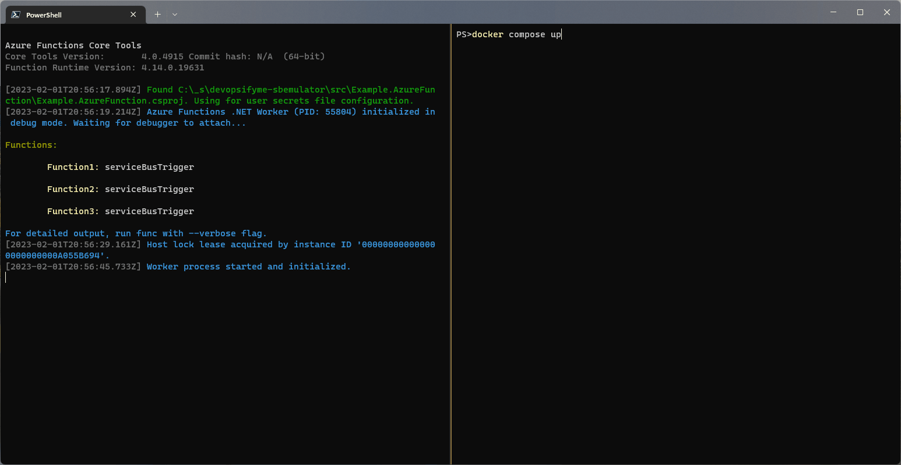

# DevOpsifyMe - Azure Service Bus Emulator

Emulator is really an AMQP 1.0 proxy that translates Azure Service Bus specifics into backend implementation specifics. Backend is an actual queue implementation that runs locally, not in cloud, and handles the messages. The main use case is to help with local development experience and with integration testing where application code cannot change driver easily.

See instructions for running from [Docker](docs/install-docker.md), running from [Package](docs/install-package.md), and [here](docs/examples.md) examples of client implementations.

At the moment following backends are supported:

* RabbitMQ (AMQP 0.9)
* InMemory (only simple message pipe)

Other backends possible to get implemented:
* Azure Storage Queue (with local Azurite emulator)
* Apache ActiveMQ (also local, supports AMQP 1.0)
* other per need basis

## How to run?

* Add "devopsifyme-local.servicebus.windows.net 127.0.0.1" to /etc/hosts
* Add /docker/testca/cacert.cer to Trusted Root on your local machine
* Start RabbitMQ container, or use any other installation you might already have
* Start ServiceBusEmulator, change configuration if needed
* Update connection string in your application :)

## Supported Features

Current implementation is considered experimental, but from initial tests it works pretty well with standard Azure Functions triggers and outputs. So messages are going through queues, topics and subscriptions. Following features are supported:

* Sending, Receiving, Peeking messages, including metadata
* Message Annotations: TTL, ID, Header, ApplicationData, and more
* Queues, Topics and Subscriptions
* Renew Locks (dummy)

## Not Supported Features

* Dead Letter (not implemented yet)
* Message Annotations: partitions, groups, reply-to and more (ignored)
* Sessions, Transactions
* Scheduled and Delayed messages
* Rules
* Any AMQP Draft Extensions
* Any Advanced Flow Control
* Not for production use, ever

